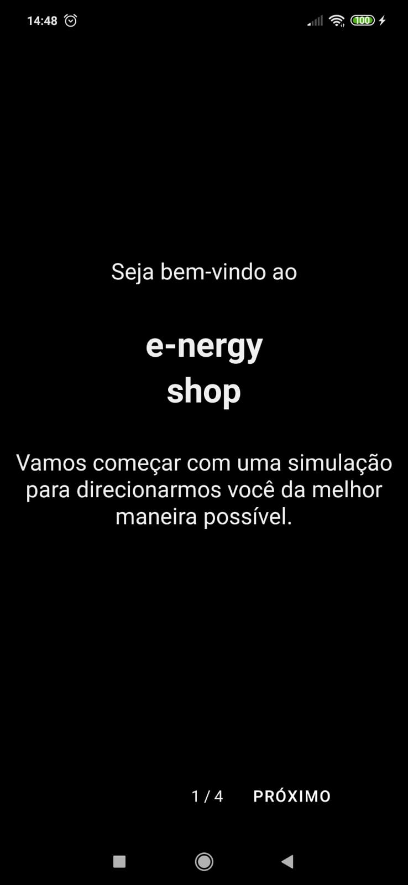

# e-nergy shop

O projeto possui duas pastas:

- __api__: backend da aplicação feito em python utilizando fastapi
- __app__: mobile app feito em react native

Video para youtube: https://www.youtube.com/watch?v=dGrbS1zDWF0&T

